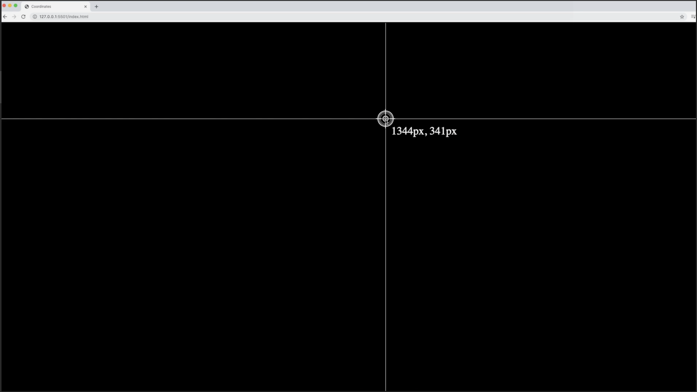

# 좌표를 찾아라 007

;

1. 버튼을 start, stop을 할까?
  - 시작하면 좌표를 읽을 수 있게 한다.
  - 그만두면 좌표를 다 날아가고 이벤트가 멈춘다.?

2. 그에 맞는 css와 마크업 구조를 만든다.
  - 배경 및 버튼 작업
  - 마우스 이벤트가 가는 곳에 선과 좌표의 이미지를 넣는다.
 
## TODO LIST
- [X] html 마크업 구조 및 스타일 작성
- [X] css 작성